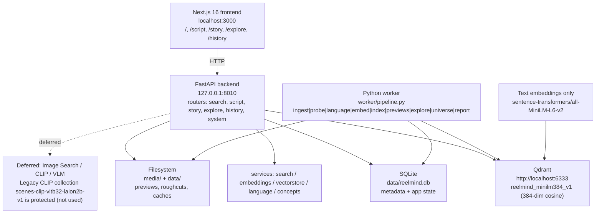
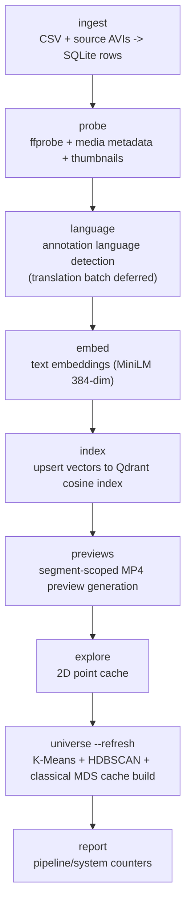
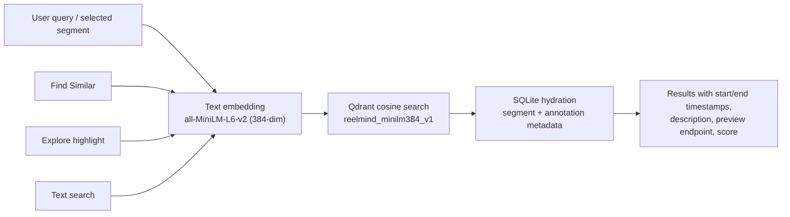
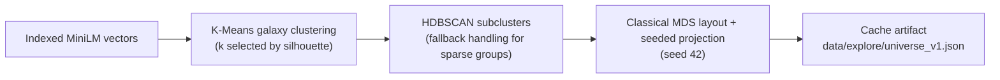
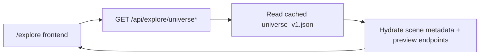
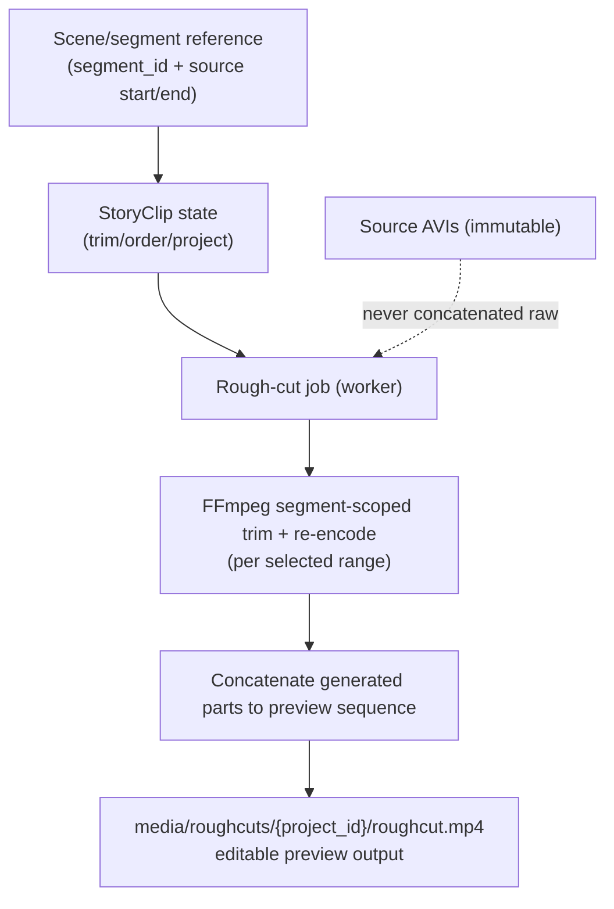

# fRAMES Studio  Architecture

## 1. Architecture Goal

Build ReelMind as a semantic video retrieval system with a lightweight editing layer.

Primary requirement:

> Convert text or image intent into searchable scene representations, retrieve exact timestamped moments, and move selected scenes into an editable rough-cut workflow.

Design principle:

**Index once. Retrieve many times. Keep media separate from metadata and embeddings.**

---

# 2. Implemented Stack (Local)

Authoritative source: `AGENTS.md`. Supporting references: `ARCHITECTURE.MD`, `Agent_Plan.md`, `productfeatures.md`.

| Layer | Implemented choice | Responsibility / status |
|---|---|---|
| Web app | Next.js 16 + TypeScript (`localhost:3000`) | Discover, Script, Story, Explore, History |
| API | FastAPI (`127.0.0.1:8010`) | Search, script-to-B-roll, story/rough-cut, explore, history, health/stats |
| Text embeddings | `sentence-transformers/all-MiniLM-L6-v2` (384-dim) | Query + annotation embeddings for semantic retrieval |
| Vector DB | Local Qdrant (`http://localhost:6333`) | Collection `reelmind_minilm384_v1`, cosine search |
| Relational/state DB | SQLite (`data/reelmind.db`) | Metadata, searches, projects/story clips, jobs, history |
| Media + caches | Local filesystem (`media/`, `data/`) | Source AVIs, previews, rough cuts, embedding shards, Explore cache |
| Worker | `python worker/pipeline.py <stage>` | One stage per command: ingest/probe/language/embed/index/previews/explore/universe/report |

Deferred / legacy (not active runtime path):
- Image Search / CLIP / VLM is **deferred**.
- Legacy Qdrant collection `scenes-clip-vitb32-laion2b-v1` is **protected** and not used by text retrieval.

---

# 3. System Context



---

# 4. Core Data Model

## Video

Represents one source asset.

```text
video
- id
- project_id nullable
- storage_key
- filename
- duration_ms
- width
- height
- fps
- orientation
- created_at
```

## Scene

Represents a searchable timestamped segment.

```text
scene
- id
- video_id
- start_ms
- end_ms
- shot_index
- thumbnail_key
- description
- environment
- mood
- people_count
- orientation
- created_at
```

## Detection

Optional structured visual evidence.

```text
detection
- id
- scene_id
- type
- label
- confidence
- bbox_x
- bbox_y
- bbox_w
- bbox_h
```

## Embedding

Vector data belongs in Qdrant. SQLite can store model/version metadata.

```text
embedding_meta
- scene_id
- model_name
- model_version
- modality
- vector_version
```

## Search

```text
search
- id
- user_id
- project_id nullable
- type text|image|script|similar
- query_text nullable
- source_scene_id nullable
- created_at
```

## Search result

Persist IDs and ranking metadata, not duplicate scene records.

```text
search_result
- search_id
- scene_id
- rank
- score
- explanation nullable
```

## Project

```text
project
- id
- user_id
- name
- created_at
- updated_at
```

## Story clip

A reference to a scene plus user-specific trim/order data.

```text
story_clip
- id
- project_id
- scene_id
- order_index
- source_start_ms
- source_end_ms
- in_ms
- out_ms
- beat_id nullable
```

Do not duplicate source media for every Story clip.

---

# 5. Video Ingestion Pipeline



Runtime rule: the API serves indexed/cached artifacts. It does **not** run model training and does **not** recompute the Explore universe during normal page loads.

### Segmentation strategy

Start with shot/scene boundaries. Avoid frame-level indexing in MVP because vector count and query cost grow rapidly.

For each segment, retain:

- Start/end timestamp.
- Segment-level metadata and timestamps in SQLite.
- Text annotations used to create MiniLM embeddings.
- Vector payload and IDs in Qdrant.

Add finer temporal windows only when evaluation shows shot-level retrieval is too coarse.

---

# 6. Semantic Retrieval Pipeline



```text
Canonical retrieval path:
query -> text embedding -> Qdrant cosine neighbors -> SQLite metadata hydration -> ranked timestamped results
```

Image Search / CLIP / VLM is deferred and not part of the active retrieval path.

---

# 7. Retrieval Ranking

Do not expose raw vector distance as the only relevance score.

Reference ranking pipeline:

```text
Vector similarity
      +
Query concept overlap
      +
Metadata/filter match
      +
Optional reranker score
      =
Final ranking score
```

Keep score components available internally for debugging.

User-facing result card can show a normalized relevance indicator and explanation. Exact numeric score is optional.

---

# 8. Query Understanding Contract

Use a structured internal representation.

Example:

```json
{
  "query": "A tired programmer working late at night",
  "entities": ["person", "laptop", "coffee"],
  "actions": ["typing", "working"],
  "environment": ["office", "indoor", "dark"],
  "context": ["late-night work"],
  "mood": ["focused", "tired"],
  "filters": {
    "people_count": 1
  }
}
```

Treat this structure as an internal contract. UI labels may change without changing retrieval code.

---

# 9. Explore Architecture

Explore should use the same indexed scene identity as search.

Offline cache build (`python worker/pipeline.py universe --refresh`):



Runtime flow:



The API serves cached universe data and scene metadata; it does not recompute clustering/projection on normal page loads.

---

# 10. History Architecture

History is event metadata, not a media store.

Recommended events:

```text
search.created
search.reopened
scene.opened
scene.selected
scene.added_to_story
scene.find_similar
image_search.created (deferred feature event)
rough_cut.generated
```

Each event references IDs. Large payloads stay out of the history table.

Saved searches can be represented as named search definitions rather than duplicated result sets.

---

# 11. Clip Editor Architecture

The editor stores references to source scenes and user trim/order decisions.



### Preview

For MVP, previews are generated from segment-scoped trims; source media remains immutable.

### Rough Cut

Rough Cut job receives:

```json
{
  "project_id": "...",
  "clip_ids": ["..."],
  "beat_order": ["beat-1", "beat-2"],
  "options": {
    "max_duration_ms": 30000
  }
}
```

Worker generates a sequence/preview output from selected story clip references; source AVIs are not modified.

Example sequence manifest:

```json
{
  "clips": [
    {"scene_id": "s1", "in_ms": 1400, "out_ms": 4200},
    {"scene_id": "s9", "in_ms": 0, "out_ms": 3100}
  ]
}
```

This separation keeps editing state fast and reversible.

---

# 12. API Surface

Reference endpoints:

```text
POST   /api/videos
POST   /api/videos/{video_id}/index
GET    /api/videos/{video_id}
GET    /api/scenes/{scene_id}
GET    /api/scenes/{scene_id}/preview

POST   /api/search/text
POST   /api/search/image   (deferred in AGENTS.md status model)
POST   /api/search/script
POST   /api/search/similar
GET    /api/search/{search_id}

GET    /api/explore/points
GET    /api/explore/scene/{scene_id}

GET    /api/history
POST   /api/history/saved
DELETE /api/history/saved/{id}

GET    /api/projects/{project_id}
POST   /api/projects/{project_id}/clips
PATCH  /api/projects/{project_id}/clips/{clip_id}
DELETE /api/projects/{project_id}/clips/{clip_id}
POST   /api/projects/{project_id}/rough-cut
GET    /api/projects/{project_id}/rough-cut/{job_id}
```

Exact route style can follow the existing application convention.

---

# 13. Background Jobs

Long-running work should not block normal API requests.

Jobs:

- Video indexing.
- Scene extraction.
- Embedding generation.
- Transcript extraction.
- Thumbnail generation.
- Explore projection generation.
- Rough-cut generation.
- Final preview rendering when added.

Job states:

```text
queued -> running -> succeeded
                 -> failed
```

Every job needs an ID and error state. Do not hide worker failures behind permanent loading states.

---

# 14. Storage Rules

## Filesystem (`media/`)

Store:

- Original video.
- Scene thumbnails.
- Proxy video.
- Generated preview.
- Optional rendered rough cut.

## SQLite (`data/reelmind.db`)

Store:

- Product metadata.
- Relationships.
- User/project state.
- Search metadata.
- Editor state.
- Job state.

## Qdrant (`reelmind_minilm384_v1`)

Store:

- Text-embedding vectors (MiniLM, 384-dim).
- Lightweight filter payload.
- Scene ID and video ID.

Do not put large descriptions or media blobs into vector payloads.

---

# 15. Security and Reliability

- Validate upload MIME type and file extension.
- Enforce maximum upload size and duration.
- Never trust client-provided timestamps or media metadata.
- Store generated files under controlled keys.
- Prevent path traversal in source filenames.
- Restrict project access by authenticated user/project ownership.
- Do not expose backend filesystem/media credentials to browser clients.
- Use controlled media endpoints for private assets when needed.
- Record model/version used for embeddings.
- Make ingestion jobs idempotent.
- Make retries safe.
- Keep source media immutable.

---

# 16. Observability

Track retrieval quality, not only API latency.

Core metrics:

- Search latency.
- Indexing latency.
- Queue latency.
- Search result count.
- Click-through rate on results.
- Add-to-Story rate.
- Find-Similar usage.
- Rough-cut generation time.
- Retrieval recall on evaluation set.
- Top-k relevance.

Log:

- Search ID.
- Model/version.
- Query type.
- Candidate count.
- Top-k scores.
- Filters used.
- Reranker version.

Do not log raw private media or sensitive user content unnecessarily.

---

# 17. Evaluation Strategy

Build a small labeled benchmark before tuning ranking.

Each benchmark case contains:

```text
query
expected scene IDs
acceptable scene IDs
negative scene IDs
```

Measure:

- Recall@K.
- Precision@K.
- MRR.
- NDCG where useful.
- Median search latency.

For deferred image search, plan to store reference image plus expected scene IDs.

For Script-to-B-roll, evaluate beat-level retrieval separately from final sequence ordering.

---

# 18. MVP Deployment

Local development:

```text
Next.js
FastAPI
SQLite
Qdrant
FFmpeg
Local filesystem (`media/`, `data/`)
Worker process
```

Production can move object storage and workers to managed infrastructure without changing the core data model.

Avoid Kubernetes for initial deployment unless required by existing infrastructure.

---

# 19. Architecture Decisions

### Decision: Scene-level indexing first

Reason: Lower vector count, faster indexing, simpler timestamps. Add finer temporal retrieval only after benchmark evidence.

### Decision: Separate vector store from relational DB

Reason: Vector search and transactional application state have different access patterns.

### Decision: Store editor state as references

Reason: Reuse source media. Keep edits small, reversible, and fast.

### Decision: Treat AI explanations as derived metadata

Reason: Explanations can change with model versions. Source scene identity remains stable.

### Decision: Keep model/version metadata

Reason: Re-indexing should be reproducible and comparable.
