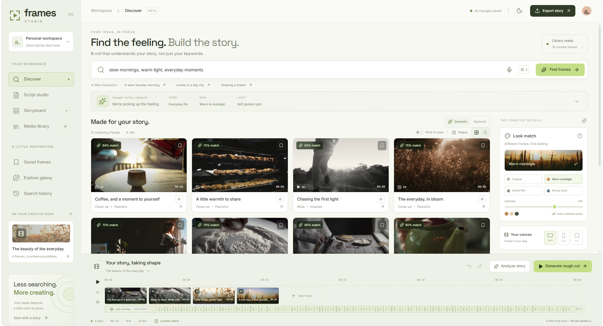
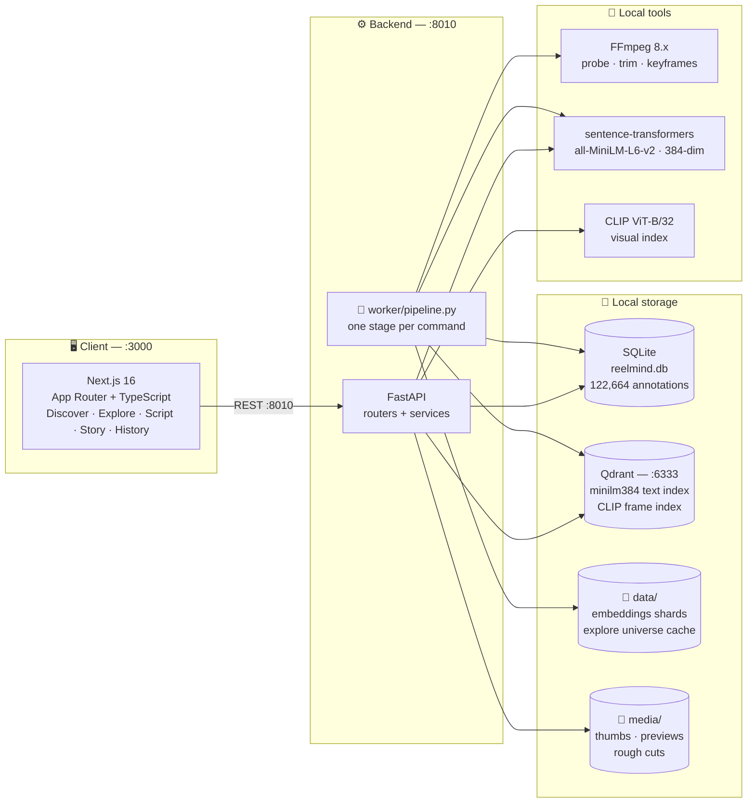
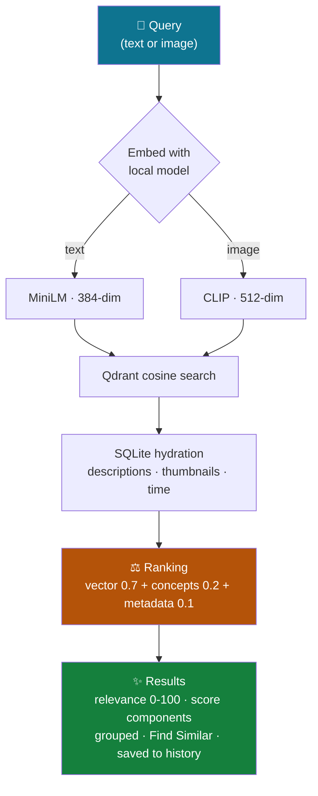

<div align="center">

# 🎬 Frames Studio <sub><sup>(ReelMind)</sup></sub>

**A fully local AI B-roll discovery & editing studio**

Search 122,664 video annotations semantically · explore the whole corpus as a navigable
galaxy · turn a script into B-roll suggestions · rough-cut a sequence — all on your own
machine, with **no cloud APIs** in the runtime path.

[](https://nextjs.org)
[](https://fastapi.tiangolo.com)
[](https://www.python.org)
[](https://qdrant.tech)
[](https://www.sqlite.org)
[](https://ffmpeg.org)
[](#status)

</div>

---

## 📸 Dashboard




---

## ✨ What it does

| | Page | What you get |
|---|---|---|
| 🔍 | **`/` Discover** | Semantic search over segment descriptions. Type a scene ("a crowded night market with lanterns"), get ranked, grouped results with thumbnails and playable previews. Find Similar to refine from any result. |
| 🌌 | **`/explore` Visual Content Universe** | The whole corpus rendered as a galaxy: 20 K-Means galaxies, 55 HDBSCAN subclusters, classical MDS layout, all from a cached JSON. Click a star = open the segment. |
| 📝 | **`/script` Script → B-Roll** | Paste a script; get per-line B-roll suggestions and concept breakdown (entities, actions, environment, mood). |
| 🎬 | **`/story` Story / Clip editor** | Assemble selected segments into a sequence, scrub a timeline, export a rough cut with FFmpeg (segment-scoped trims only — raw sources are never concatenated directly). |
| 🕰️ | **`/history` History** | Saved searches and event log; re-run or unsave them. |

### 🔎 Search modes

- **📝 Text → segments** — embed the query with `all-MiniLM-L6-v2` (384-dim), cosine search in
  Qdrant, hydrate from SQLite. No keyword/LIKE fallback anywhere in the retrieval path.
- **🧩 Find Similar** — `semantic` (text description), `visual` (CLIP frame embedding), or
  `hybrid` (reciprocal rank fusion of both).
- **🖼️ Image → segments** — upload a reference frame; CLIP embeds it and searches the frame
  index (`scenes-clip-vitb32-laion2b-v1`).

⚖️ Ranking combines vector similarity (**0.7**), concept overlap (**0.2**), and metadata
filters (**0.1**), then exposes the raw components per hit so the UI can show *why*
something ranked.

---

## 🗺️ Architecture

```mermaid
flowchart LR
    A["📂 ingest<br/>CSV + AVI matching"] --> B["🔬 probe<br/>ffprobe · sha256 · thumbs"]
    B --> C["🌐 language<br/>detection (+ translation)"]
    C --> D["🔢 embed<br/>384-dim shards"]
    D --> E["📦 index<br/>Qdrant upsert"]
    E --> F["🎞️ previews<br/>browser MP4"]
    F --> G["🧭 explore<br/>2D projection"]
    G --> H["🌌 universe<br/>K-Means + HDBSCAN + MDS"]
    H --> I["📊 report<br/>acceptance counters"]

    style A fill:#0e7490,color:#fff
    style E fill:#0e7490,color:#fff
    style H fill:#0e7490,color:#fff
    style I fill:#334155,color:#fff
```







**Repo layout**

```
frontend/   Next.js 16 (App Router, TypeScript)        :3000
backend/    FastAPI (routers + services)               :8010
worker/     pipeline.py — one stage per command
data/       reelmind.db + embedding shards + Explore cache + reports
media/      thumbnails, previews, rough cuts            (not committed)
YouTubeClips/  source AVIs                              (not committed)
assets/     README images (dashboard screenshot, …)
```

**🧰 Runtime services**

- **Qdrant** at `http://localhost:6333` — `reelmind_minilm384_v1` (384-dim, cosine,
  70,051 points) for text; `scenes-clip-vitb32-laion2b-v1` for CLIP frames.
- **FFmpeg 8.x** — probes, thumbnails, previews, keyframe extraction, rough cuts.
- **SQLite** — single source of truth: 122,664 annotations, 2,089 segments (1,970 ready),
  videos, searches, events, embedding metadata, detections.

**🛡️ Key invariants** (enforced in code, see `AGENTS.md`):

1. Embedding dimensionality is read from the model config — never hardcoded; the vector store
   raises on a dimension mismatch instead of silently deleting collections.
2. The legacy CLIP collection is write-protected from the text path.
3. No cloud APIs (Clerk/Gemini/etc.) in the runtime path.
4. The Explore galaxy is a cached artifact — clustering never recomputes on page load.
5. Caches (pip/HF/npm) live on `D:\Epoch_Final\.cache` because `C:` is nearly full.
6. Rough cuts trim segment-scoped time ranges with re-encoded timestamps.

---

## 🚀 Quick start

### 📋 Prerequisites

- Python 3.14 with `fastapi uvicorn qdrant-client sentence-transformers torch --index-url https://download.pytorch.org/whl/cpu` (CPU torch is fine)
- Node 24+ / npm 11+
- FFmpeg on `PATH`
- A local Qdrant server: `docker run -p 6333:6333 qdrant/qdrant` (or the native binary)

### 1️⃣ Backend

```powershell
cd backend
python -m uvicorn app.main:app --host 127.0.0.1 --port 8010
```

🩺 Health check: `http://127.0.0.1:8010/api/health` — reports vector-store, embedding, and
image-search status plus index counts.

### 2️⃣ Frontend

```powershell
cd frontend
npm install
npm run dev          # http://localhost:3000
```

`frontend/.env.local` (already set in this checkout):

```
NEXT_PUBLIC_API_BASE=http://127.0.0.1:8010
```

### 3️⃣ Data pipeline (from repo root)

```powershell
python worker/pipeline.py ingest      # CSV + video matching  -> SQLite
python worker/pipeline.py probe       # ffprobe / sha256 / thumbnails
python worker/pipeline.py language    # language detection (+ optional local translation)
python worker/pipeline.py embed       # local embedding shards
python worker/pipeline.py index       # upsert vectors into Qdrant
python worker/pipeline.py previews    # MP4 previews for browser playback
python worker/pipeline.py explore     # 2D projection cache
python worker/pipeline.py universe    # Visual Content Universe clustering cache
python worker/pipeline.py report      # acceptance counters + system state
```

`python worker/pipeline.py all` runs ingest → probe → language → embed → index in order.
Rebuild only the galaxy cache with `python worker/pipeline.py universe --refresh` (~15 s).

✅ The repo ships with the pipeline already run: the SQLite DB, 15 embedding shards, and the
Explore universe cache are committed under `data/`, so the app works immediately after
starting the backend and frontend.

---

## 🔌 API surface

Base: `http://127.0.0.1:8010`

| | Group | Endpoints |
|---|---|---|
| 🔍 | Search | `POST /api/search` (text), `POST /api/search/image` (base64 reference frame), `POST /api/search/similar`, `POST /api/search/script`, `GET /api/search/{id}` replay |
| 🎞️ | Segments | `GET /api/segments/{id}` — metadata + annotations + detections + embedding rows |
| 📂 | Videos | `POST /api/videos` (raw stream + `X-Filename`), `GET /api/videos`, `POST /api/videos/{id}/index` |
| 🎬 | Story | story/clip-editor endpoints, `POST /api/story/rough-cut` → `media/` output |
| 🌌 | Explore | `GET /api/explore/universe` (cached galaxy), `GET /api/explore/scene/{segment_id}` |
| 🕰️ | History | `GET /api/history`, `POST /api/history/saved`, `DELETE /api/history/saved/{id}`, `GET /api/history/events` |
| 🩺 | System | `GET /api/health`, `GET /api/stats`, `GET /api/metrics` |

Full route table and contract details: `ARCHITECTURE.MD` (§12).

---

## 🧪 Tests & evaluation

```powershell
pytest tests/test_api.py                              # needs the API on :8010
python tests/make_eval_fixture.py                     # build labeled fixture
python tests/eval_retrieval.py                        # Recall@k / MRR report
```

📈 Retrieval quality is measured against a labeled fixture of queries with acceptable/negative
segment IDs; results are written to `data/eval_report.json`.

---

## 💾 Data notes

- **📦 Dataset**: `MSR Video Description Corpus.csv` (read-only) + `YouTubeClips/*.avi`.
  Segments are identified as `video_id:start-end`; filename clocks are original YouTube
  positions.
- **✅ Committed**: `backend/`, `worker/`, `frontend/` (source), `data/` (DB, embedding shards,
  Explore cache, reports, logs), `.cache/` (model/package caches).
- **❌ Not committed** (see `.gitignore`): `YouTubeClips/` (1.85 GB source video), `media/`
  (derived media), `*.csv` dataset, and two cache files that exceed GitHub's 100 MB
  per-file limit (BLIP blobs, one pip body).

### 🐘 Repo size caveat

This repo contains the SQLite database and embedding shards so it runs out of the box.
Cloning it pulls ~640 MB. Use `git clone --depth 1` if you only want the latest state.

---

## 📊 Status

✅ **Implemented and verified end-to-end**: ingest → probe → language → embed → index →
previews → explore → universe, plus all five frontend pages, semantic search, Find Similar,
and the Explore galaxy.

🕓 **Deferred by design**:

- **🖼️ Image search** — code path exists (`services/clip.py`, `visualstore.py`,
  `POST /api/search/image`) but the CLIP weights are not yet downloaded (the model folder in
  `.cache` holds placeholders only); first `visual` stage run fetches them.
- **🌐 Non-English translation** — provider abstraction is in place (`services/language.py`);
  the ~38k-row batch has not run. The index is English-only today.
- **🤖 VLM image captioning** — `IMAGE_VLM_PROVIDER = "disabled"`; BLIP weights are cached but
  intentionally excluded from git (1.5 GB, over GitHub's per-file limit).

---

## 📚 Further reading

- 📖 `ARCHITECTURE.MD` — the binding spec: data model, pipeline stages, ranking contract,
  API surface, jobs, observability, evaluation.
- 🧠 `AGENTS.md` — architecture source of truth and per-feature status table.
- 📋 `Agent_Plan.md`, `productfeatures.md` — original plan and feature list.
